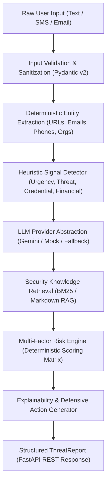

# ScamShield AI — Architecture Documentation (Day 1)

## Executive Summary

**ScamShield AI** is a multimodal AI security analyst designed to detect digital fraud, social engineering, credential harvesting, malicious links, and financial deception. 

This document outlines the architectural blueprint implemented during **Day 1** of the 3-day hackathon sprint, focusing on the core backend pipeline, deterministic security analysis, LLM provider abstraction, localized knowledge retrieval (RAG), and explainable risk scoring.

---

## High-Level Pipeline Architecture

The end-to-end processing pipeline transforms raw communication input into a structured, explainable threat report through six decoupled stages:



---

## Detailed Pipeline Stages

### 1. Input Validation & Ingestion
- Handled at the API boundary via FastAPI and Pydantic v2 schemas (`AnalyzeRequest`).
- Trims whitespace, validates input encoding, rejects empty payloads, and enforces a 20,000-character upper bound to prevent denial-of-service and payload-stuffing vulnerabilities.
- Formats validation errors into a uniform error envelope:
  ```json
  {
    "error": {
      "code": "INVALID_INPUT",
      "message": "Content must not be empty."
    }
  }
  ```

### 2. Deterministic Entity Extraction
- Extracts high-value artifacts prior to LLM invocation using compiled, regular expressions:
  - **URLs**: Canonical web addresses and deceptive links.
  - **Emails**: Sender and recipient email addresses.
  - **Phone Numbers**: National and international numbers (E.164, Indian mobile, standard formats).
  - **Organizations**: Keyword detection covering major banking, technology, and postal institutions (e.g., SBI, HDFC, Paytm, FedEx, Amazon, Microsoft).

### 3. Heuristic Signal Detection (`HeuristicDetector`)
- Calculates deterministic security signal strengths in the range `[0.0, 1.0]` across four core threat vectors:
  1. **Artificial Urgency**: Keywords like `urgent`, `immediately`, `within 24 hours`, `final notice`.
  2. **Fear & Coercion (Threat Language)**: Keywords like `account suspended`, `police`, `arrest`, `penalty`.
  3. **Credential Harvesting**: Keywords like `OTP`, `PIN`, `password`, `KYC`, `verify your account`.
  4. **Financial Fraud**: Keywords like `UPI`, `transfer`, `refund`, `cash prize`, `crypto`, `deposit`.
- **Design Decision**: These values are explicitly treated as deterministic heuristic signal strengths rather than pseudo-machine learning probabilities, providing transparent explainability.

### 4. LLM Provider Abstraction (`LLMProvider`)
- Implements an abstract base class `LLMProvider` defining `analyze(content, entities, heuristics) -> Optional[Dict[str, Any]]`.
- Concrete implementations:
  - **`GeminiProvider`**: Uses the official `google-genai` SDK with strict JSON schema instructions, system prompts, zero temperature, and fallback handling.
  - **`MockLLMProvider`**: Provides deterministic, reproducible test and offline analyst responses.
- **Graceful Fallback Mode**: If the LLM provider fails, times out, or lacks credentials, the system automatically transitions into `analysis_mode = "heuristic_fallback"`, guaranteeing zero downtime.

### 5. Local Security Knowledge Retrieval (`SecurityKnowledgeRAG`)
- Local retrieval-augmented generation engine operating over domain markdown files in `backend/app/knowledge/`:
  - `phishing.md`
  - `social_engineering.md`
  - `impersonation.md`
  - `malicious_urls.md`
  - `credential_theft.md`
  - `financial_scams.md`
  - `job_scams.md`
- Tokenizes and indexes documents into semantic chunks.
- Queries chunks using BM25 (`rank-bm25`) with Jaccard keyword fallback, mapping detected threat types and query tokens to ground-truth evidence snippets with source citations and relevance scores.

### 6. Transparent Risk Engine (`RiskEngine`)
- Multi-factor risk engine with transparent mathematical weighting:
  - **With LLM Available**:
    - LLM Threat Score: 40% (or 55% when URLs are absent)
    - Heuristic Signals (Urgency & Threat): 30% (or 25% when URLs are absent)
    - URL Indicators (Suspicious TLDs / IP / Structure): 20% (0% when URLs are absent)
    - Credential & Financial Requests: 10% (or 20% when URLs are absent)
  - **Heuristic Fallback Mode (LLM Unavailable)**:
    - Heuristics: 45–50%
    - URL Indicators: 25%
    - Credential/Financial: 25–50%
- Strict boundary mapping to categorical Severity:
  - `0 – 20`: `SAFE`
  - `21 – 40`: `LOW`
  - `41 – 60`: `MEDIUM`
  - `61 – 80`: `HIGH`
  - `81 – 100`: `CRITICAL`

### 7. Explainability & Defensive Recommendations
- Returns structured indicators (`category`, `severity`, `evidence`, `description`).
- Synthesizes an executive natural-language explanation.
- Produces defensive recommendations tailored to detected indicators (e.g. "DO NOT provide OTP", "Verify via official mobile app", "Contact bank immediately").

---

## System Quality & Security Considerations

1. **No External Network Calls for Domain Reputation (Day 1)**: URLs are parsed and analyzed purely via deterministic structural indicators (TLD, IP address format, hyphenation). Full network intelligence is reserved for Day 2.
2. **Zero Hardcoded Secrets**: Configuration is strictly managed via environment variables and `.env` files using `pydantic-settings`.
3. **Fail-Safe Operation**: If external AI services encounter transient outages or rate limits, the pipeline falls back to heuristic scoring without throwing 500 errors.
4. **Structured Logging**: Clean logging without recording sensitive credentials, passwords, or personal PII.
