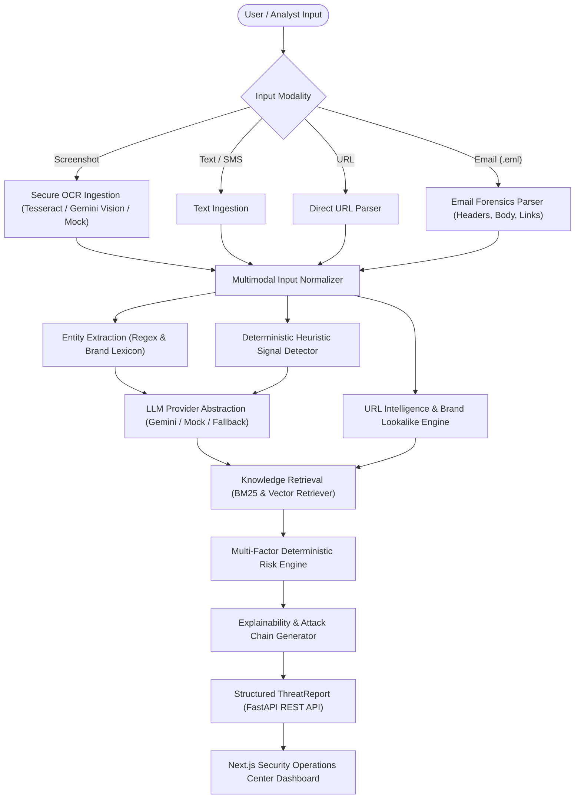

# ScamShield AI — Architecture Documentation (Day 3 Hackathon Release)

## Executive Summary

**ScamShield AI** is an explainable multimodal AI security analyst designed to detect digital fraud, social engineering, credential harvesting, malicious links, brand impersonation, and fraudulent email communications.

This document details the complete multimodal architecture finalized for the **Day 3 Hackathon Release**, uniting Text, Screenshots (OCR), URL Intelligence, and raw RFC 822 Email Forensics with a deterministic hybrid risk engine, security knowledge RAG, explainable attack chains, and an interactive Next.js Operations Center.

---

## High-Level Multimodal System Architecture



---

## Multimodal Subsystems (Day 2 Additions)

### 1. Multimodal Input Normalizer (`InputNormalizer`)
- Maps heterogeneous formats (`text`, `screenshot`, `url`, `email`) into a unified `NormalizedInput` schema.
- Extracts and aggregates URLs, email addresses, phone numbers, and brand mentions across all modalities.
- Ensures the downstream threat evaluation engine remains unified without code duplication.

### 2. Screenshot Analysis & Image Security (`OCRService`)
- **Endpoint**: `POST /api/v1/analyze/image`
- **Security Validation (`ImageSecurityValidator`)**:
  - Rejects files larger than 10 MB.
  - Enforces strict MIME and extension validation (`image/png`, `image/jpeg`, `image/webp`).
  - Verifies file integrity via Pillow `img.verify()` to block corrupted or malicious file payloads.
  - Operates in-memory without persistent disk leakage.
- **Hierarchical OCR Engine**:
  1. *Local Tesseract OCR* via `pytesseract` if system binary is available.
  2. *Vision-capable Multimodal LLM* (Gemini Vision) via official SDK if configured.
  3. *Deterministic Fallback* for offline testing and test repeatability.
  - Measures `ocr_duration_ms` separately from overall analysis latency.
  - Never fabricates confidence numbers (`confidence = null` if unavailable).

### 3. URL Intelligence & Brand Impersonation (`URLIntelligenceService`)
- **Endpoint**: `POST /api/v1/analyze/url`
- **Structural Anomaly Detection**:
  - Raw IP address hostnames.
  - Suspicious top-level domains (`.xyz`, `.top`, `.site`, `.club`, `.biz`, `.info`, `.buzz`, `.online`, etc.).
  - Excessive subdomains ($\ge 4$ labels).
  - Deceptive hyphenation (e.g., `sbi-secure-login.xyz`).
  - Punycode / IDN homoglyph markers (`xn--`).
  - Recognized URL shortening services (`bit.ly`, `tinyurl.com`, `t.co`, etc.).
  - Sensitive credential paths (`/verify`, `/login`, `/kyc`, `/account`, `/banking`).
  - Unusually long URLs ($> 75$ characters).
- **Brand Impersonation**:
  - Configurable corporate signatures in `brand_signatures.json` (SBI, HDFC, ICICI, PayPal, Amazon, FedEx, DHL, Microsoft, etc.).
  - Compares hostname against brand aliases and official domain whitelists.
  - Accurately classifies lookalikes as `potential_impersonation` while keeping official domains safe.
- **External Reputation Abstraction**:
  - `URLReputationProvider` abstraction. Returns `reputation_status = "unavailable"` if live threat API keys are absent, avoiding fabricated ratings.

### 4. Email Forensics (`EmailForensicsService`)
- **Endpoint**: `POST /api/v1/analyze/email`
- Accepts RFC 822 `.eml` files.
- Extracts metadata: `From`, `To`, `Reply-To`, `Subject`, `Date`, text/HTML body, and attachments.
- **Header Anomaly Detection**:
  - Flags `Reply-To != From` domain mismatches (a classic credential harvesting signal).
  - Detects Display Name Spoofing (e.g. brand name in display title with third-party freemail domain).
  - Surfaces SPF, DKIM, DMARC statuses from `Authentication-Results` headers (marking as `"not_present"` if headers are omitted, without false failure claims).

### 5. Knowledge Retrieval RAG (`KnowledgeRetriever`)
- Decouples retrieval into an abstract `KnowledgeRetriever` base class.
- Retains high-speed deterministic `BM25Retriever` indexing local security markdown documentation.
- Extensible to dense vector embeddings (`VectorRetriever`).

### 6. Signature Feature: Visual Attack Chain
- Converts structured threat indicators and entities into an intuitive, sequential attack progression:
  ```text
  Brand Impersonation (SBI)
             ↓
  Urgency & Coercion Pressure (Today / 24h)
             ↓
  Credential / KYC Solicitation
             ↓
  Deceptive Link (sbi-secure-login.xyz)
             ↓
  Potential Account Takeover
  ```
- Renders dynamically on both the REST API and the Next.js Security Dashboard.

---

## REST API Summary

| Method | Endpoint | Description |
| :--- | :--- | :--- |
| `GET` | `/health` | Health status and version telemetry |
| `GET` | `/` | Service root and interactive docs link |
| `POST` | `/api/v1/analyze` | Text communication threat analysis |
| `POST` | `/api/v1/analyze/image` | Screenshot OCR extraction and threat analysis |
| `POST` | `/api/v1/analyze/url` | Direct URL intelligence and risk assessment |
| `POST` | `/api/v1/analyze/email` | Raw `.eml` email forensics and threat scoring |

---

## Defensive Engineering & Security
 
- **Strict Input Validation**: Max 20,000 characters for text, max 10 MB for images and emails.
- **Safe Memory Processing**: Uploaded files are evaluated in-memory using validated streams and cleaned up immediately.
- **No Secret Leakage**: API keys and environment variables are strictly encapsulated in `Settings`.
- **Deterministic Repeatability**: Identical inputs yield identical risk scores across all 73 automated unit and integration tests.
- **Quantitative Benchmark**: Verified on `data/sample_messages.json` (10 malicious, 5 benign) with 100% Accuracy, 100% Precision, 100% Recall, and F1 = 1.0000 via `backend/evaluation/evaluate_dataset.py`.
